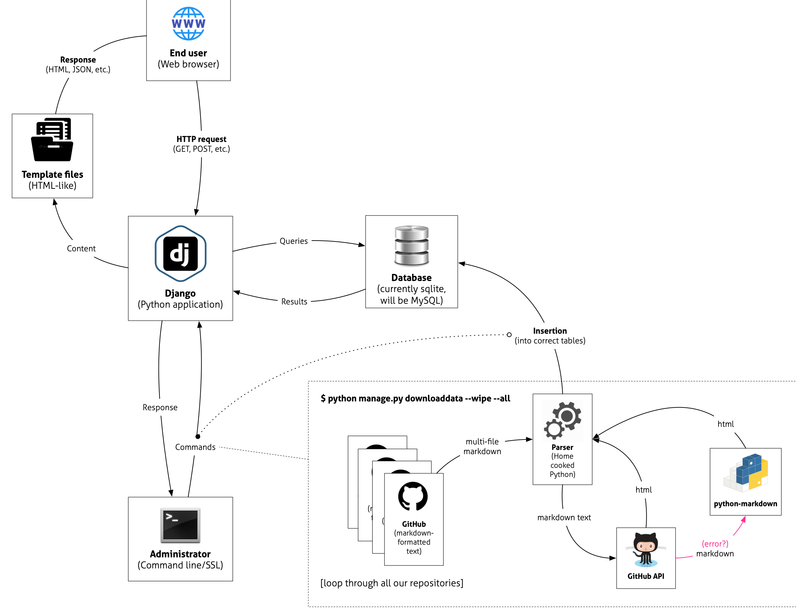

# Digital Humanities Research Institute's curriculum website (Django)

This is the alpha 4 version of the DHRI's curriculum website (created as a django app).

Belongs to: [Sprint 4](https://www.github.com/DHRI-Curriculum/django-app/milestone/3)  
Deadline: August 6, 2020

---

## Documentation

### All Contents

- [Installing](_docs/install.md)
- [Populate Database](_docs/populate.md)
- [Run Server](_docs/run.md)
- [Setting up a new workshop](_docs/setup-workshop.md)
- [Changing Settings](_docs/settings.md)

---

### Workflow

In order to explain the workflow of what happens in the application, here is a visual representation of the flow from the end user and the administrator end, and both of their interactions with the Django application.

When the **end user** sends a HTTP request to the server, **Django** (in reality, Django's `wsgi` application, but we will not get into that now) will handle the request, and use its internal settings to send appropriate queries to the **backend database**. In this `alpha-3` version, the database backend is a sqlite database, but in a future version we will use MySQL or PostgreSQL. The database will send back its results, and Django will send the response to its **template generator**, which will create the response (in HTML format, in most cases, to the end user).

On the **administrator**'s side, we can interact with django through the built-in `manage.py` command, via the command line. With our Django application comes a custom-built command that can run through Django's `manage.py`, and it's called `downloaddata`. The easiest way to run it, is to run `python manage.py downloaddata --wipe --all` (for more information about this command, see [Populate Database](_docs/populate.md)).

Once you run the `downloaddata` with the `--all` flag, it will loop through all repositories, downloading all of the markdown files from respective repositories, and parse them, using a "home-cooked" Python script. The script converts markdown to HTML, as well, first trying to do so through [GitHub's REST API](https://docs.github.com/en/rest/reference/markdown) (via [PyGithub](https://github.com/PyGithub/PyGithub)) and, if that fails, using the [Python-Markdown](https://github.com/Python-Markdown/markdown) package, with some plug-ins.

---

## Scenarios

To make the documentation more navigable, here are some common scenarios, and how you can get this Django deployment up and running.

### Install and run

Are you trying to install the Django app and run it on a local machine? Here are the three steps you need to follow:

1. [Installing](_docs/install.md)
2. [Populate Database](_docs/populate.md)
3. [Run Server](_docs/run.md)

### Add a new workshop

Are you trying to create a new workshop for an already existing installation of django-app? You will find instructions in [Setting up a new workshop](_docs/setup-workshop.md).
