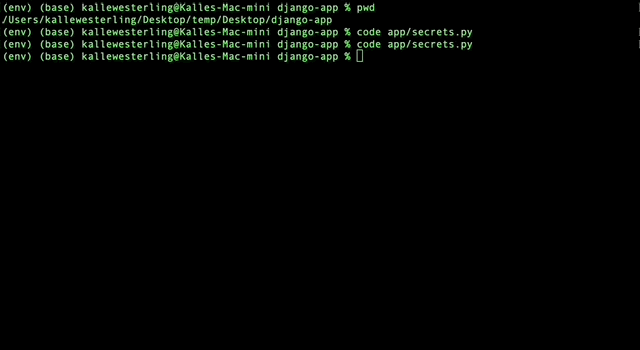

# Populate Database

In order to populate (and update) the content on the DHRI curriculum website using the live data from GitHub, there is a simple two-part process. This app has been built with support to:

1. mirror all the data from the DHRI Curriculum; and
2. ingest the data into the database.

The two sections below should cover the process in general, and also provides link to more detailed information if you want to dig deeper into the process.

---

If your database is not yet set up, you will need to first set up the database by running two commands from Django's built-in management script. To make the process smoother, you can comine both on the command line by joining them using `&&`:

```sh
$ python manage.py makemigrations && python manage.py migrate
```

That should tell you which migrations that will run, and then proceed to run the migrations:



```sh
No changes detected
Operations to perform:
  Apply all migrations: admin, assessment, auth, contenttypes, feedback, glossary, insight, install, learner, lesson, library, sessions, website, workshop
Running migrations:
  Applying contenttypes.0001_initial... OK
  Applying auth.0001_initial... OK
  ...
```

## Step 1. Mirror the live data: `build`

Next, we want to make a mirrored copy of all of the data that lives in the GitHub repositories related to the DHRI curriculum. We can do so with the `build` shortcut command:

```sh
$ python manage.py build
```


This will take some time—up to several minutes—so get yourself a cup of coffee. You're doing well!

The `build` command should create a local "mirror" of all the GitHub repositories related to the DHRI curriculum, inside a directory called `_preload` in the root of the repository.

There is a (large) possibility of you running into error message, warnings, etc. in this process. Don't worry too much about them; the ones that will stop the import of the data to the database will stop you in your tracks with a red error message. Everything else is on a "warning" level, which means that you can safely continue with the process. All of this is described in the [debugging](debug.md) part of the documentation.

Once the `build` command has finished, you can move on to Step 2 below, or read the following section with more detailed information about the `build` command.

### More details about `build`

#### Optional flags

The `build` command can also be called using flags that modify its function:

| Flag              | Behavior                                                                                                        |
| ----------------- | --------------------------------------------------------------------------------------------------------------- |
| `--silent`        | Makes as little output as possible, although still saves all the information in log files (see [debugging docs](debug.md)).          |
| `--verbose`       | Provides _all_ output possible, which can be overwhelming. Good for debug purposes, not for the faint of heart. |

#### Behind the scenes

The `build` command is in fact a "shortcut" that actually runs a number of commands, which can also be run individually, in the correct order:

1. buildgroups
2. buildusers
3. buildglossary
4. buildinstalls
5. buildinsights
6. buildworkshop
7. buildblurbs

All of these can be placed in place of `build` on the command line above, like so:

```sh
$ python manage.py buildgroups
$ python manage.py users
$ python manage.py ...
```

To read more detail about each of these commands and their respective required flags, etc., see [here](detail-build.md).

## Step 2. Ingest the data from your local files: `ingest`

In the following step, we want to ingest the mirrored copy of all of the data that lives in the GitHub repositories, downloaded and structured in Step 1. We can do so with the `ingest` shortcut command:

```sh
$ python manage.py ingest
```


Granted that you do not run into any problems (warnings, error messages, etc.), the database should now be fully populated with the information necessary to get it all [up and running](run.md).

### More details about `ingest`

#### Optional flags

The `ingest` command can also be called using flags that modify its function:

| Flag              | Behavior                                                                                                        |
| ----------------- | --------------------------------------------------------------------------------------------------------------- |
| `--silent`        | Makes as little output as possible, although still saves all the information in log files (see [debugging docs](debug.md)).          |
| `--verbose`       | Provides _all_ output possible, which can be overwhelming. Good for debug purposes, not for the faint of heart. |
| `--reset`         | Removes all the DHRI-related objects in the database and starts a fresh installation.                           |
| `--resetusers`    | Removes all the users in the database and starts a fresh installation from the [users.yml](add-new-user.md) file. |
| `--force`         | Automatically selects "yes" for questions about whether database objects should be updated. "Forces" its way.   |

#### Behind the scenes

Just like the `build` command, `ingest` is a "shortcut" that runs a number of commands, which can, just like the `build` commands parts, be run individually. The `ingest` command runs them all in the correct order:

1. ingestgroups
2. ingestusers
3. ingestglossary
4. ingestinstalls
5. ingestinsights
6. ingestworkshop
7. ingestsnippets
8. ingestblurbs
9. ingestprerequisite

To read more detail about each of these commands and their respective required flags, etc., see [here](detail-ingest.md). All of this is described in the [debugging](debug.md) part of the documentation.

---

### Continue install track

[<< Previous step](install.md) | [Next step >>](run.md)_